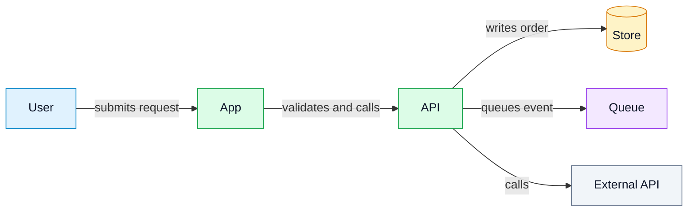
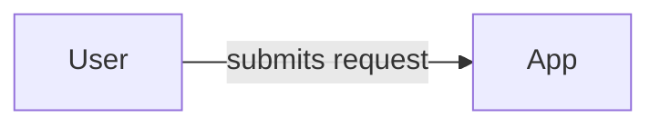
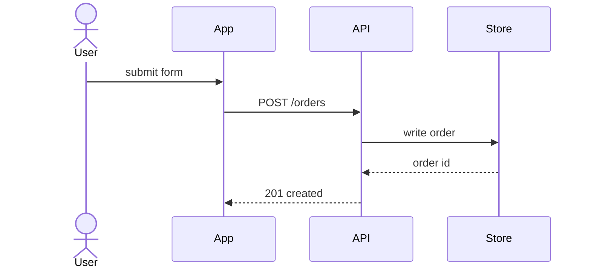
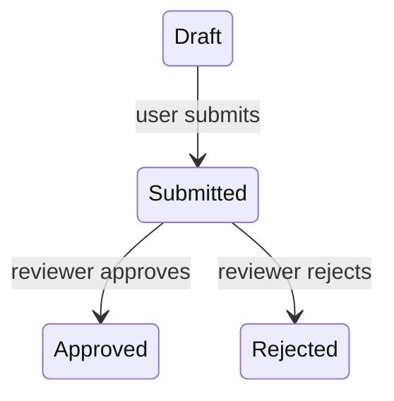
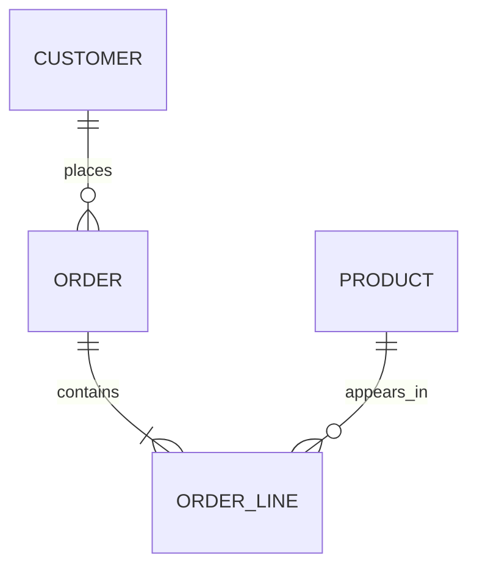

# Diagram Reference

Shared diagram reference for docs, planning, architecture, and diagram-specific workflows.

Use this as the source of truth for Mermaid diagram choice, supported renderers, edge labels, and visual quality. Load it only when the selected workflow needs a diagram.

## Rules

- Use diagrams only where they reduce cognitive load.
- Keep broad overviews small; split dense maps into focused views.
- Label the view type and direction.
- Put diagrams near the explanation they support.
- Keep diagrams source-backed; label unknowns.
- Prefer explicit edge labels over bare arrows when the relationship is not obvious.
- Do not rely on color alone; labels and structure must carry the meaning.

## Visual Quality

Diagrams should be polished and visually pleasant when the renderer supports it. Use restrained, consistent colors to clarify roles, boundaries, risk, or state.

- Use a small semantic palette across a doc or wiki: actor, service, data, queue, external, decision, risk.
- Prefer soft fills, readable borders, and high-contrast text.
- Use color to reinforce meaning, not as the only signal.
- Use `classDef` and `class` for Mermaid graph styling when supported by the target renderer.
- Treat styling in Azure DevOps as best effort; validate in the target wiki when using `classDef`, newer syntax, or custom styling.

Recommended graph palette:



## Diagram Choices

| Need | Prefer |
|---|---|
| Actors, systems, ownership, trust boundaries | `graph LR` or `graph TB` |
| Request, job, event, retry, or failure flow | `sequenceDiagram` |
| Entity/state/lifecycle | `erDiagram` or `stateDiagram-v2` |
| Object model or public interface shape | `classDiagram` |
| Requirement traceability | `requirementDiagram` |
| Release timeline or milestone history | `timeline` or `gantt` |
| Git branch/release shape | `gitGraph` |
| Proportions | `pie` only when exact values are less important than shape |

## Mermaid Types

Mermaid supports more diagram types than most renderers. Check the target renderer before using newer or less common diagrams.

| Type | Declaration | Azure DevOps wiki | Use for |
|---|---|---|---|
| Flowchart | `graph` in Azure DevOps, `flowchart` elsewhere | Yes, use `graph` | Systems, components, dependencies, decisions |
| Sequence | `sequenceDiagram` | Yes | Ordered interactions and request/event flows |
| Gantt | `gantt` | Yes | Schedule bars and delivery windows |
| Class | `classDiagram` | Yes | Object models, interfaces, relationships |
| State | `stateDiagram-v2` | Yes | Lifecycles, transitions, modes |
| User journey | `journey` | Yes | User task steps and sentiment/effort |
| Pie | `pie` | Yes | Small proportional comparisons |
| Requirements | `requirementDiagram` | Yes | Requirement-to-test/component traceability |
| Git graph | `gitGraph` | Yes | Branch, merge, release flow |
| Entity relationship | `erDiagram` | Yes | Data model and cardinality |
| Timeline | `timeline` | Yes | Chronological events or milestones |
| Quadrant chart | `quadrantChart` | No documented Azure DevOps support | Priority/positioning matrix |
| C4 | `C4Context`, `C4Container`, etc. | No documented Azure DevOps support | C4 architecture views |
| Mindmap | `mindmap` | No documented Azure DevOps support | Brainstorming or taxonomy |
| ZenUML | `zenuml` | No documented Azure DevOps support | UML-style sequence alternatives |
| Sankey | `sankey` | No documented Azure DevOps support | Quantity or cost flows |
| XY chart | `xychart` | No documented Azure DevOps support | Small line/bar charts |
| Block | `block` | No documented Azure DevOps support | Spatial block layouts |
| Packet | `packet` | No documented Azure DevOps support | Packet/header layouts |
| Kanban | `kanban` | No documented Azure DevOps support | Work state boards |
| Architecture | `architecture-beta` | No documented Azure DevOps support | Icon-based architecture sketches |
| Radar | `radar-beta` | No documented Azure DevOps support | Multi-axis comparisons |
| Event modeling | `eventmodeling` | No documented Azure DevOps support | Event-modeling timelines |
| Treemap | `treemap-beta` | No documented Azure DevOps support | Hierarchical proportions |
| Venn | `venn-beta` | No documented Azure DevOps support | Set overlap |
| Ishikawa | `ishikawa` | No documented Azure DevOps support | Cause/effect analysis |
| Wardley | `wardley` | No documented Azure DevOps support | Evolution/value-chain strategy maps |
| TreeView | `treeView-beta` | No documented Azure DevOps support | Hierarchical trees |

## Edge Labels

Use edge labels to say what the arrow does. Prefer verb phrases such as `reads`, `writes`, `validates`, `calls`, `publishes`, `queues`, `triggers`, `owns`, `contains`, `verifies`, or `deploys`.

| Diagram | Label syntax | Example |
|---|---|---|
| Graph | `A -->|label| B` | `API -->|writes order| Store` |
| Sequence | `A->>B: label` | `App->>API: POST /orders` |
| State | `A --> B : label` | `Draft --> Submitted : user submits` |
| Class | `A --> B : label` | `Controller --> Service : uses` |
| ER | `A ||--o{ B : label` | `Customer ||--o{ Order : places` |

Unlabeled arrows mean only "connected to" or "depends on". If direction, data, command, ownership, or side effect matters, label it.

## Azure DevOps Compatibility

- Use `::: mermaid` containers for Azure DevOps wiki pages unless the target project has verified fenced `mermaid` blocks render correctly.
- Use `graph LR` or `graph TB` for flowcharts; do not use the `flowchart` declaration in Azure DevOps.
- Avoid long arrows such as `---->`, most HTML, Font Awesome icons, and links to or from `subgraph`.
- Prefer the Azure DevOps-supported types in the table above.
- Test diagrams in the target wiki when using newer Mermaid syntax or custom styling.

Azure DevOps wiki form:

```text
::: mermaid
graph LR
    User[User] -->|submits request| App[App]
:::
```

Portable Markdown form:



## Common Mermaid







## Sources

- Mermaid syntax reference: https://mermaid.js.org/intro/syntax-reference.html
- Mermaid flowchart syntax: https://mermaid.js.org/syntax/flowchart.html
- Mermaid sequence syntax: https://mermaid.js.org/syntax/sequenceDiagram.html
- Azure DevOps Markdown and Mermaid guidance: https://learn.microsoft.com/en-us/azure/devops/project/wiki/markdown-guidance
