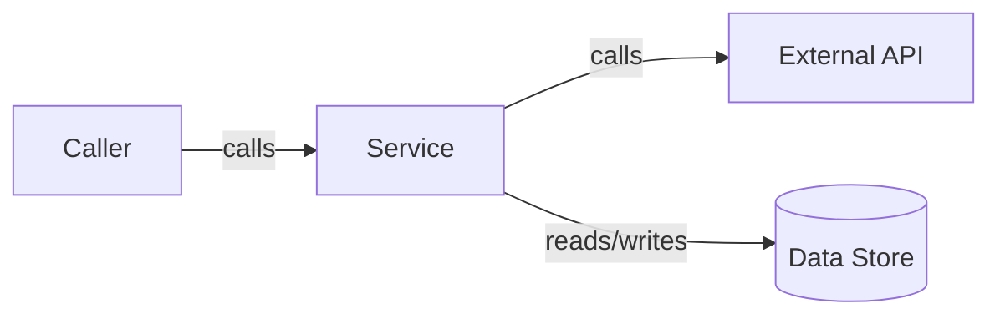

# Diagram Reference

Use diagrams only when they reduce cognitive load.

For Mermaid syntax, supported diagram types, Azure DevOps compatibility, edge labels, and visual quality, use `$diagrams` and `../../../references/diagrams/diagrams.md`.

## Default Choices

| Need | Diagram |
|---|---|
| Actors, external systems, trust boundaries | Context graph |
| Runtime units, stores, queues | Container/layer graph |
| Internals of one service/module | Component graph |
| Request, job, event, or failure flow | Sequence diagram |
| Entity/state/lifecycle | ER/state graph |
| Environments, deployment, rollback | Deployment/rollout graph |

## Rules

- Label the view type and direction.
- Prefer ASCII in chat; Mermaid for persisted docs.
- Keep one primary flow direction.
- Split dense diagrams.
- Put operation semantics on edge labels: read, write, enqueue, trigger, validate.
- Show trust boundaries and ownership only when they matter.
- For Azure DevOps Mermaid, follow the shared diagram reference.

## Minimal ASCII

```text
View: Context, direction left-to-right

+--------+      +---------+      +--------------+
| Caller | ---> | Service | ---> | External API |
+--------+      +----+----+      +--------------+
                    |
                    v
              +-----------+
              | Data Store|
              +-----------+
```

## Minimal Mermaid


